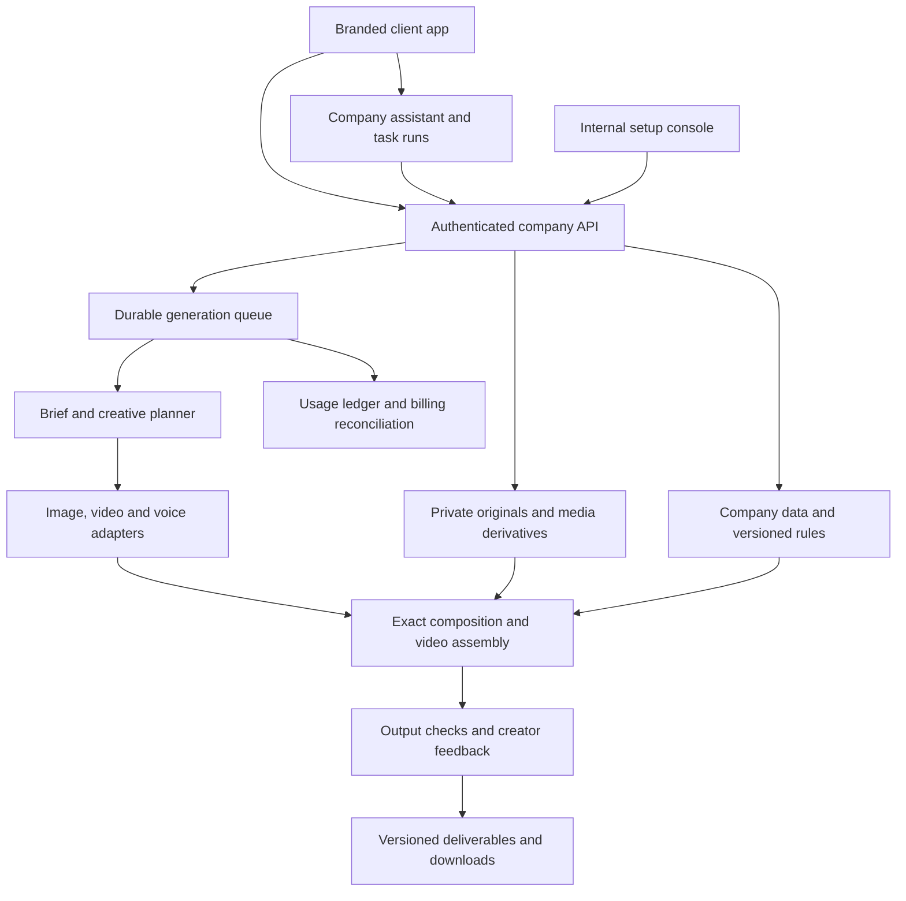

# Company Campaign Studio — product and build plan

September 15, 2026 · Proposed implementation plan · Renewal by Andersen reference

> **Current scope update — September 17, 2026:** CRM outcomes are no longer part of the product. CRM destinations, imports and CRM-derived reporting described in this historical plan are superseded. Creative Insights and read-only Meta reporting remain core.

## 1. The product we are building

Each home-service company gets a creative studio that looks and works like its own branded software. Our team configures the company once. Its marketing team then enters a monthly offer, creates static ads, videos and UGC-style content, revises freely, and downloads immediately.

The experience should preserve what makes Zuops approachable: clear creation tools, references, model choices, reusable settings, visible previews, and easy movement between tools. Our defining capability is persistent company context: the interface, assets, creative rules, business facts and campaign details follow the user everywhere.

**One platform, a personally branded experience for every company.** Shared software lets us improve all client workspaces together; isolated data and versioned configuration make each workspace its own enterprise product.

### Decisions already made

- Feed and Classroom are core Community sections, matching the reviewed Zuops layouts and interactions inside each company theme. See [Community and Classroom](COMMUNITY-AND-CLASSROOM.md).
- Separate companies and subscriptions; the eleven interested VPs are not eleven branches of one brand.
- Managed setup by our team, independent use by the client after handoff.
- Company branding applies to both the app interface and its creative output.
- Home is a full company-aware personal assistant, with a simple Zuops-style conversation layout. See the [assistant specification](COMPANY-ASSISTANT.md) for capabilities, memory, tool use and acceptance criteria.
- Beneath the assistant, Home includes Creative Studio model cards and a shared Winning Ads feed. Every company can browse the same published references and remix them into its own private brand/campaign. See the [shared discovery specification](SHARED-LIBRARY-AND-MODELS.md).
- Each company connects its own authorized Meta ad accounts during onboarding, with account selection, history import, automatic refresh and reconnect/disconnect controls. See [Meta connections](META-CONNECTION.md).
- Creative Insights is core scope: actual ad reporting, home-service outcomes, evidence-linked recommendations and branded variations. Measured results, benchmarks and forecasts remain distinct. See [Creative Insights](CREATIVE-INSIGHTS.md).
- Real company media, AI-generated scenes/presenters, and mixed productions.
- Original creation, reference remixing, and optional layouts/video styles.
- Monthly campaign context reused across static, video and UGC tools.
- Client ownership of generated content as a product requirement.
- Immediate downloads; no agency or manager approval queue.
- Renewal by Andersen is the first reference experience.
- Confirmed launch distinction: Renewal is the prototype brand, using assets supplied through the user's existing work with Renewal. A different company will be the first live customer; that company's identity and intake are still to be determined. Prototype assets and data must remain separate from the launch customer's workspace.
- Latest implementation direction: build the working Renewal product now. Ryan has not yet supplied the first real client's assets; that is not a development blocker. Use configurable company systems and a synthetic second test company until the real launch materials arrive. See the [Cursor handoff](../CURSOR-HANDOFF.md).
- Astra and Seedance 2.5 are preferred model directions. Zuops alternatives belong in the provider evaluation backlog; display names do not establish production API access.

## 2. Two connected company systems

| System                 | What we configure                                                                                                               | What the client experiences              |
| ---------------------- | ------------------------------------------------------------------------------------------------------------------------------- | ---------------------------------------- |
| Interface theme        | Logo, workspace name, favicon, colors, type roles, selected navigation, buttons, welcome imagery, sign-in, notification styling | “This is our company's creative studio.” |
| Creative design system | Exact logos/fonts, layouts, product media, captions, motion, offer cards, end cards, voice, claims and terms                    | “Everything I make starts in our brand.” |

Both are versioned independently. Changing a sidebar color does not silently restyle old ads. Updating an offer does not change the permanent brand. A creative records the brand and offer versions used to make it.

### How company personalization works

Every client receives a theme package, asset library, creative package and business profile. The application selects these from the authenticated company workspace. Users land directly in their own company; they never need an agency-wide customer selector.

**Personalized:** company identity, accent palette, supported fonts, photography, example campaigns, default styles, terminology, feature availability, and optional company domain.

**Consistent platform behavior:** navigation structure, keyboard controls, editor interactions, accessible focus and contrast, job states, download behavior, and security. Avoid custom code forks per client. Exceptional enterprise deployment requirements can be scoped separately.

### Renewal interface direction

- Light workspace, white panels, black headings, dark-gray secondary text, restrained borders.
- Renewal Green **#6CC14C** for primary actions and selection markers; black text on green.
- Primary type direction: **ITC Franklin Gothic Std**. Use supplied source fonts only after confirming suitable web use; use an explicit fallback where necessary.
- Actual approved company logo in production. Generated mockup lettering is a placeholder, not production logo artwork.
- Warm, lived-in home photography, windows, doors and installation details.
- Compact grouped sidebar, generous preview canvas, clear forms, minimal ornament.
- No white text on Renewal Green, no green text on white, and no ornamental gradients.
- Friendly, direct interface language: “Create variations,” “Replace scene,” “Download.”

The supplied brand guide is the design source. Existing ads are creative references and can contain treatments that differ from the guide. See [brand foundations](../library/renewal-by-andersen/BRAND-SYSTEM-NOTES.md).

## 3. Navigation and screen map

| Area              | Main jobs                                          | Key actions                                                                                              |
| ----------------- | -------------------------------------------------- | -------------------------------------------------------------------------------------------------------- |
| Home / Assistant  | Think, find, plan and create through conversation  | Ask anything, attach a file, select optional campaign context, use compact tool shortcuts, resume a chat |
| Feed              | Participate in the shared community                | Post, get feedback, comment, browse events and published ads                                             |
| Classroom         | Learn the app and company workflows                | Search/filter tutorials, watch lessons, browse coaching/help recordings                                  |
| Campaigns         | Keep offer, brief, copy and deliverables together  | New campaign, duplicate campaign, revise offer, download selected outputs                                |
| Static Studio     | Compose an original or template-based static       | Add assets, choose format, generate, edit layers, create variants, download                              |
| Video & UGC       | Build commercial, presenter and mixed-media videos | Script, choose presenter, arrange scenes, replace one scene, captions, render, download                  |
| Remix             | Adapt a reference's layout, hook or story          | Upload/select reference, choose what to preserve, substitute company assets, open studio                 |
| AI Models         | Explore the complete model catalog                 | Search/filter, inspect capabilities and availability, choose a compatible model                          |
| Winning Ads       | Discover shared references across companies        | Filter static/video/UGC, inspect results, save, remix for my brand                                       |
| Creative Insights | Measure ads and identify the next creative test    | Select metrics, filter/group, compare, inspect evidence, analyze, create variations                      |
| My Assets         | Find originals and completed work                  | Search, filter, upload, inspect, reuse, download                                                         |
| Templates         | Browse layouts, video styles and reference ads     | Preview, favorite, remix, inspect evidence where available                                               |
| Brand System      | Understand the configured company system           | View interface/creative rules, browse assets, see examples and version                                   |
| Settings          | Company access and subscription                    | Invite users, roles, usage, billing, provider preferences, integrations                                  |

Editing belongs inside the relevant studio rather than a disconnected destination. Carousel creation extends the static document model. Creative Insights is a core destination, populated from authorized account data or traceable client reports; unavailable data is clearly identified.

### Visual concepts

1. **Home / Assistant:** simple centered welcome and chat composer, two starter prompts, compact toolkit and history access; closely follows the supplied Zuops layout.
2. **Static Studio:** input controls, large editable creative, style/layer controls, variants, direct download.
3. **Video & UGC:** script and scene controls, large playback canvas, scene timeline, real/AI media selection.
4. **Brand System:** app appearance alongside creative rules and output examples. Makes the personalization promise tangible.
5. **Assistant conversation:** company-aware planning, asset references and actions that continue into production tools.
6. **Home discovery:** the scrolled section beneath the assistant, with Creative Studio model cards and the latest shared ad examples.
7. **Winning Ads:** shared discovery, evidence details and a private destination for branded remixes.
8. **All Models:** dedicated searchable catalog matching the supplied Zuops grid, with Image/Video filters, grid/list views, provider identities and all 17 observed media-model entries.

9. **Community Feed:** composer, category controls, discussion stream and member/event/published-ad rail, closely following Zuops.
10. **Classroom:** searchable three-column tutorial catalog, lesson player flow and coaching/help archives.

11. **Creative Insights:** sample CPL, qualified leads, appointments and revenue alongside visual ad cards and reporting controls.
12. **Ad performance:** creative preview, actual-result view, video attention, funnel and next-test actions.
13. **CPL forecast:** separate illustrative predicted range and creative rubric, including insufficient-data behavior.
14. **Meta connection:** account selection, imported history and sync-health concepts.

15. **Campaigns:** monthly brief, versioned offer, campaign context and affected creatives.
16. **My Assets:** source media, saved creations, metadata and import recovery.
17. **Export:** selected files/formats, matching copy and version manifest, immediate download.
18. **Team, usage and subscription:** member access, activity and commercial-setting placeholders.
19. **Internal company setup:** asset intake, theme/rules, readiness and workspace activation before handoff.
20. **Activity:** persistent generation jobs, partial results, focused retries and notifications.
21. **Match Meta ads:** reviewed links from source ads to exact exported creative versions.
22. **CRM outcomes:** field mapping, match coverage, validated import and the next variation brief.

See [complete workflows and results linkage](WORKFLOWS-AND-RESULTS.md) for detailed interactions, states and acceptance criteria. These additions complete the design pass for sections 1 and 2 of the completeness audit. Output/provider validation and commercial decisions in sections 3 and 4 remain open.

These images communicate visual direction. They are illustrative raster mockups, not functioning software, verified production outputs, or an exact implementation of source logos/fonts.

## 4. The monthly campaign journey

### Start from the information that changed

The marketing manager pastes the monthly brief or starts inside any creation tool. Extract the campaign name, service/product, offer, dates, applicable market, CTA/destination and exact terms into editable fields. Reuse saved company facts. Ask only about missing information required for the requested output.

The assistant can handle this entire setup conversationally. It can also answer questions, search company assets, brainstorm or write copy without requiring campaign setup. Shared company knowledge, personal preferences and conversation memory remain separate. Chat and the dedicated studios edit the same versioned campaign and creative documents.

A campaign can contain awareness ads without a promotion. Do not force a financing or discount form onto every creative.

**Renewal example:** “September Window & Door Event.” The supplied Kentucky offer is historical source material, not a default offer for every market or a future campaign. A production campaign uses the client's entered offer and associated terms.

### Choose a starting point

- **Idea:** describe a new ad and choose media/format.
- **Reference:** adapt the hook, composition or story of an existing ad.
- **Style:** begin with a product spotlight, before/after, presenter + footage, offer-led layout or installation story.

These paths converge in the same studios. Switching paths preserves campaign context and selected assets. Templates accelerate work without constraining every ad to the same composition.

### Create, revise, download

The studio proposes or generates the requested work. Users can edit copy, move supported layers, replace a photo, select a presenter or change a scene. Natural-language editing complements direct controls. Preserve unaffected elements and earlier versions.

Every completed creative has **Download**, **Edit**, **Create variation**, and a relevant **Reuse** action. Include placement format and copy alongside files. Batch download includes descriptive filenames and a copy sheet. Direct publishing is a later integration decision.

### Offer changes

Save offers as versions. When the client changes a deal or expiry, identify affected creatives and offer a batch update. Preserve prior versions and their downloads. Findings assist the creator; they do not create an agency sign-off step.

## 5. Static production

Treat a static as an editable document with image/background, product, logo, text, offer, CTA and disclosure elements. AI supplies visual material and layout suggestions. A controlled renderer places exact source marks, fonts and text.

The first release should support proposed 1:1, 4:5 and 9:16 outputs with responsive compositions, not crude stretching. Confirm placement requirements during implementation. Allow original layouts, curated templates, selected asset replacement, text editing and multiple variations.

For product accuracy, distinguish a decorative generated room from an actual represented product. Use real source imagery or an approved product composite when exact window/door construction matters. Text and brand overlays should remain editable without buying a new background generation.

## 6. Video and UGC production

A video is a scene document: script, source media, timing, voice/audio, captions, graphics, transitions and ending. Each scene knows whether it uses company footage, generated footage or a generated presenter.

### Initial video styles

- Product/home showcase.
- Installation story using company footage.
- Presenter + product footage.
- Natural UGC-style walkthrough or explanation.
- Offer commercial with branded opening/ending.

Provide a recommended storyboard that can be changed or replaced. Scene-specific regeneration preserves the other scenes. Captions, lower thirds, offer graphics and end cards use the company's design system; provide safe placement and audio controls.

Use actual authorized customer evidence for testimonials. Generated presenters communicate the company's message without silently becoming named real customers or employees. Before/after evidence uses actual paired source material when presented as a completed real project.

Proposed pilot exports: short 15- and 30-second assembled ads. A final ad can combine several clips; a provider's single-clip duration is not the final timeline limit. Exact supported sizes, quality and generation costs are established by provider tests.

## 7. Library and remix system

Use three clearly labeled collections:

1. **Company assets:** source media, logos/fonts, product assets, scripts, saved outputs.
2. **Templates and styles:** reusable compositions and story structures configured for the company.
3. **Winning Ads / shared references:** a platform-wide published collection available in every company's themed workspace, with measured examples and separately labeled curated inspiration. Private client ads remain private unless explicitly contributed.

Home previews this shared collection below the model cards. A dedicated Winning Ads destination supports browsing, source/result inspection and **Remix for my brand**. The destination remix uses the client's own campaign, assets and creative rules and stays private. See [shared discovery](SHARED-LIBRARY-AND-MODELS.md) for the data separation, contribution and evidence model.

Verified performers require linked metrics, objective, dates, market and attribution evidence. Other references remain inspiration. Do not label an ad a winner because it is active, attractive or long-running.

For Zuops references, preserve discovered links, screenshots, notes and reusable creative patterns. Actual reusable media needs appropriate source access and usage rights. The audit did not establish a complete downloadable Zuops media collection. Import the client's supplied creative originals as company assets; translate reference structures into original company templates.

### Renewal intake status

The local catalog contains **424 source-linked files** across **34 inspected folders**: **358 brand/source assets** and **66 historical Meta-content files**. Originals remain in Drive. Selected core brand pages and sample creatives were reviewed; every file has not received a full media review.

Production intake still requires original-file import, checksums, dimensions/durations, thumbnails/proxies, source attribution, product/talent tags, duplicate review and complete rule mapping. Preserve layered/vector originals and create usable derivatives. Validate font role mapping rather than enabling every supplied face.

The library and private reports share an ad-detail experience with actual results, creative review and separately labeled forecasts. Home-service reporting prioritizes qualified leads, appointments and sold jobs. Recommendations lead into private branded variations. See [Creative Insights](CREATIVE-INSIGHTS.md).

Feed and Classroom connect this discovery loop to member discussions and training. Company-specific training remains private; the shared Feed uses explicitly published content. See [Community and Classroom](COMMUNITY-AND-CLASSROOM.md) for the observed parity map, lesson content and data model.

## 8. Our setup console

This is separate from the client's daily studio.

1. Create company and initial owner access.
2. Import and classify source assets; track errors and missing originals.
3. Configure interface theme and preview it across all major screens.
4. Build company creative rules and business facts.
5. Create initial layouts, video treatments and representative examples.
6. Configure available models and generation allowances.
7. Run a sample campaign through static, video, presenter, revision and download flows.
8. Review setup with the client and activate its versioned workspace.

After handoff the client works independently. Support access should be time-limited, permissioned and recorded. Brand updates are previewed and versioned; the ordinary creation flow stays fast.

## 9. Proposed engineering architecture

Recommended foundation: a typed web app, relational data store, private object storage, background workers and a durable job queue. Use a structured design document for static scenes and video timelines. Choose specific hosting and libraries after validating rendering and provider integrations; no version or vendor dependency is committed by this concept.

### Important records

Company, membership, subscription, interface-theme version, creative-brand version, asset and derivative, product, claim/evidence, offer version, campaign, creative document/version, template, reference/evidence, job, provider attempt, usage event and export.

The assistant adds conversation, message, personal preference, source reference, task run and tool invocation records. Durable tasks connect conversation intent to the same job queue and usage ledger. A tool's actual result determines completion; conversational text alone never establishes that an ad was generated. See the [assistant specification](COMPANY-ASSISTANT.md).

Every company-owned record carries company scope. Check authorization on reads, writes, search, preview URLs, job callbacks and downloads. Queue workers must load only the job's company context. Shared platform templates stay distinct from private company uploads.

### Analytics architecture

Read-only connector/import jobs feed source snapshots, normalized daily facts and a deterministic metric service. Reports and the assistant use these calculated results. Records include company connection, sync run, ad/creative version mapping, attribution configuration, CRM outcome, metric definition, report snapshot and publication evidence. See [Creative Insights](CREATIVE-INSIGHTS.md) for isolation, reconciliation and delayed-conversion handling.

### Reliable jobs and ownership

- States: queued, generating, composing, ready, failed and canceled.
- Browser refresh or closure must not lose jobs or outputs.
- Idempotent submission and billing events prevent duplicate work/charges on retry.
- Store output files durably; provider URLs are temporary transport.
- Record source assets, model/configuration, brand/offer versions and rendering settings.
- Show estimated usage before generation and reconciled usage after completion.
- Define cancellation and partial-result behavior; retain usable completed work.
- Client content can be exported. Clarify retention and subscription-end access before launch.

## 10. Model strategy and Zuops coverage

Use a capability registry with a provider adapter behind each available option. Registry fields include supported task, aspect ratios, clip length, references, audio, resolution, price, timeout and availability. The UI reads this registry so forms and model cards cannot contradict each other.

Each entry also has a verified provider/model identity and official logo source file. Logos retain native colors inside each company's themed UI. Home features six model cards with Browse all models; the full catalog covers the complete observed inventory in [model-inventory.json](model-inventory.json). All 17 image/video entries and four assistant/tool labels are tracked. Unresolved API/logo identities are explicitly unset rather than fabricated.

The dedicated All Models page is confirmed: a three-column searchable grid, All/Image/Video filters and grid/list toggle, accessible through Discover → AI Models and Browse all models. Selecting an available model opens its compatible studio with company/campaign context intact. The assistant's reasoning models remain available in its own selector. See the [page specification](SHARED-LIBRARY-AND-MODELS.md).

The desired reasoning lead is Astra and desired video lead is Seedance 2.5. Establish exact production API identifiers, access and capabilities before presenting them as available. The ordinary user sees a recommended option; advanced users can choose compatible alternatives. Never silently route a paid request to a materially different model or price.

The [Zuops audit](../research/zuops/REVIEW.md) recorded these displayed alternatives for evaluation:

- Reasoning/tools: Zuops default, GPT Sol 5.6, GPT Astra 6, Claude Fable 5 in a specific tool.
- Images: Nano Banana 2, GPT Image 2, GPT Image 2.5, Nano Banana Pro.
- Video: Sora 2, Kling 3.0, WAN 3.0, WAN 3.0 Prime, VEO 3.1, Seedance 2.5, Seedance 2.0, Seedance 2 Mini, Happy Horse 1.1, Hailuo 3, Omni Flash, Gemini Omni 1.1 Flash, Flux 3.

These are observed labels, not independently verified provider commitments or current availability. Retired, inaccessible or incompatible services remain unavailable in our app. Parity means evaluating the full inventory and supporting available equivalents; it does not justify nonfunctional selector entries.

Create a shared benchmark brief for exact product, realistic home, presenter, branded static, mixed video and targeted revision. Compare quality, consistency, latency and total cost including retries. This determines recommendations more reliably than model branding alone.

## 11. Release sequence and acceptance gates

No fixed calendar is promised before staffing and provider access are established. Build in dependency order; demonstrate each gate with real outputs.

| Phase                          | Deliverable                                                                                                                                                        | Exit evidence                                                                                                                                                 |
| ------------------------------ | ------------------------------------------------------------------------------------------------------------------------------------------------------------------ | ------------------------------------------------------------------------------------------------------------------------------------------------------------- |
| 1. Design definition           | Screen designs, theme/creative schema, campaign flow, output rubric                                                                                                | Agreed Renewal direction and a complete sample brief                                                                                                          |
| 2. Company foundation          | Access isolation, intake/storage, theme, company rules, campaign editor, assistant Q&A/search/planning                                                             | Two contrasting test companies; no cross-company data, memory or theme leakage; answers resolve to source material                                            |
| 3. Static production           | Real assets, exact composition, editable layers, variants, export, assistant production tools                                                                      | Original and template-based ads in proposed formats; correct source logo, text, font and terms; chat-to-editor continuity                                     |
| 4. Video & UGC                 | Scene model, company/generated media, presenter path, assembly, captions                                                                                           | Usable commercial and mixed presenter video; replace one scene without losing the rest                                                                        |
| 5. Remix, library and insights | Shared Winning Ads, actual report imports, read-only Meta sync, metric service, ad details, evidence-linked recommendations, private remixes, full model inventory | Two companies browse the same published reference and produce separate private branded remixes; model identities and availability match the verified registry |
| 5b. Community and learning     | Feed composer/categories/threads, media/polls, member/events rail, Classroom search/player/archives and content administration                                     | Two company themes use the same community while private lessons remain isolated; real published lessons open correctly                                        |
| 6. Paid pilot                  | Usage ledger, subscription handling, retries, support and onboarding playbook                                                                                      | Client independently completes campaign → revisions → immediate download; measured unit costs                                                                 |
| 7. Expansion                   | More evaluated models, carousel/bulk tools, richer CRM connectors, validated forecasting and optional publishing                                                   | Demand and reliability justify each extension                                                                                                                 |

Static validates brand fidelity early; **video and UGC are still required for the complete pilot**, not removed from the product promise. Start with Renewal as reference, then test a second materially different company theme before expanding across all eleven prospects.

### Full pilot scope

Company-branded interface and personal assistant, managed setup, assets/design system, campaign briefs, static/video/UGC, real + AI media, reference remix, templates/styles, focused edits, version history, immediate downloads, company access, subscriptions and visible usage. The assistant provides company Q&A, asset search, planning, writing and access to the same production/revision tools as the studios.

Creative Insights is included in the pilot: actual reporting, source-aware ad details, saved views, comparisons and evidence-linked remix recommendations. Read-only Meta authorization and sync are required for the connected pilot; validated report imports remain a fallback. Qualified-lead and appointment reporting uses mapped CRM exports or a connector. Numeric forecasting requires validation.

Feed and Classroom are included as core sections: shared posts and discussion, published-ad discovery, tutorials, lesson detail and coaching/help recordings. Onboarding includes original platform lessons and eligible company-specific training. A separate live community Chat/DM system is outside this addition.

### Later expansion

Direct Meta publishing, broader CRM integrations, calibrated forecasts, automated experiments, richer collaboration, large batch localization, custom domains/SSO where required, and additional Zuops specialty tools. Keep these out of the critical creation flow until needed.

## 12. Quality and validation

“Senior marketing level” must be demonstrated with outputs. Score representative work against agreed reference ads for message clarity, visual craft, product accuracy, believable footage, brand consistency, offer correctness, legibility and usefulness to the creator. Keep creative variety as a separate dimension; identical layouts with new colors are not distinct concepts.

Measure first usable output time, first-pass selection rate, revisions per selected output, cost per selected deliverable, repeat usage and independent task completion. Establish numerical targets with the pilot cohort after baseline samples. These are product metrics, not promises of ad performance.

Necessary engineering checks include tenant isolation, exact text/logo/font rendering, actual export dimensions/playback, offer-version traceability, retries without duplicate billing, webhook replay, expired provider links, partial failures, scene-specific edits and keyboard/accessibility behavior across client themes. Validate downloads after completion with no approval role required.

## 13. Business decisions to settle before paid launch

- Subscription price, included usage and overage model, grounded in measured generation costs.
- Initial clients and desired pilot date relative to available team capacity.
- Initial deliverable formats/durations and expected monthly volume.
- User invitation policy, optional enterprise identity requirements, retention/export terms.
- Whether custom domains or direct publishing are necessary for the first contracts.

These decisions do not block the visual concepts. Avoid selling unlimited generation before measuring video costs and retry rates. Setup fees, if any, are an open commercial decision.

## 14. Immediate next implementation package

The UI direction is selected. Build the working application now: import Renewal's original source assets; build persistent company, campaign and creative systems; then prove one complete monthly campaign through static, video, presenter, revision and download. Preserve the existing library catalog as the intake manifest. Another image-only or simulated frontend is not the requested next deliverable.

Use the [implementation contract](IMPLEMENTATION-CONTRACT.md) and [acceptance matrix](ACCEPTANCE-MATRIX.md) to track real functionality and exact external blockers. Pricing, future customer assets and broader enterprise choices must not block independent prototype development.

### Supporting material

- [Product concept](CONCEPT.md)
- [Community Feed and Classroom](COMMUNITY-AND-CLASSROOM.md)
- [Creative Insights and metric definitions](CREATIVE-INSIGHTS.md)
- [Meta account authorization and sync](META-CONNECTION.md)
- [Renewal reference experience](RENEWAL-REFERENCE-EXPERIENCE.md)
- [UI concept notes and prompts](ui-concepts/README.md)
- [Source-linked Renewal library](../library/renewal-by-andersen/README.md)
- [Renewal creative research](../research/renewal-by-andersen/REVIEW.md)
- [Zuops audit](../research/zuops/REVIEW.md)
