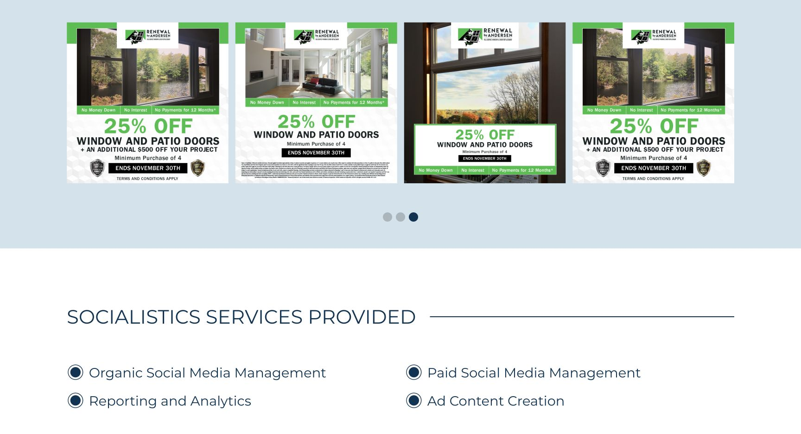
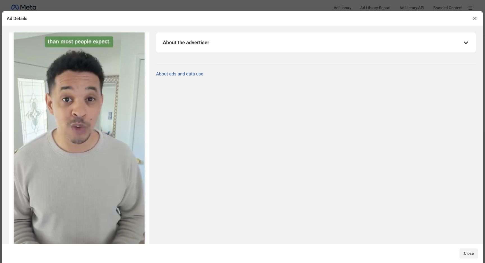
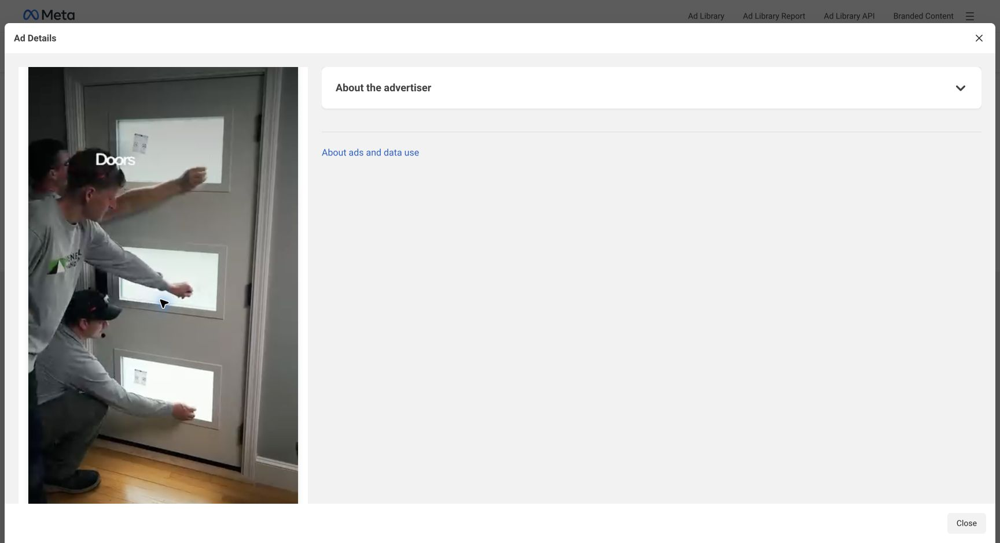

# Renewal by Andersen: creative benchmark and product implications

Research date: September 15, 2026.

## Conclusion

The public examples support the proposed product: a client enters a monthly promotion and uses familiar static, video, UGC/presenter, remix, and editing tools with the company's approved creative system automatically applied. Support both real company media and generated scenes/presenters, as confirmed by the user.

We found real active Meta ads and agency-reported campaign outcomes. **We did not establish which individual ads are the highest performing.** No ad-level spend, qualified leads, booked appointments, sales, or return data was available in the public sources inspected. Visual quality, active status, repeated versions, and longevity must not be presented as conversion rankings.

## Research scope

Two agents separately researched static and video sources using Firecrawl and public web research. The parent inspected the public Meta Ad Library in Chrome, opened individual ad details, sampled playback of three active videos, inspected two current static previews, and viewed three agency static examples in their case-study carousel.

The national RbACorp library displayed approximately 400 active results. We reviewed a selected sample, not every ad or every regional affiliate. Hiring and sweepstakes ads were excluded from the monthly sales-offer benchmark. Video observations below are based on sampled visual playback and visible captions; this is not a full audio, frame-by-frame, or production-authenticity audit. A presenter or installation scene's appearance does not establish whether it was captured or generated.

Sources and raw notes:

- [Public national Meta library](https://www.facebook.com/ads/library/?active_status=active&ad_type=all&country=US&search_type=page&view_all_page_id=119910398089617)
- [Static research](static-research.md)
- [Video research](video-research.md)
- [Saved rendered library snapshot](meta-library.txt)

## 1. Actual active Meta examples

| Example | Observed details | Creative lesson |
|---|---|---|
| [Entry-door static — 2908562306145863](https://www.facebook.com/ads/library/?id=2908562306145863) | Active since Sep 2; multiple versions. Copy offers 10% off one or more Ensemble entry doors with product availability and combination restrictions. Preview shows a home exterior and dark entry door, with black/orange urgency text. | Product photography and a strong headline can carry the composition. The surrounding ad copy and the graphic work together. The brand uses more visual variety than one green template. |
| [Regional static — 1059305530231009](https://www.facebook.com/ads/library/?id=1059305530231009) | Active since Sep 1; Sacramento landing path. Copy offers $388 off windows/$488 off doors and 48-month payment terms, ending Sep 30. Preview uses white, black and green, a problem list, a quiz CTA, and a window image marked with an orange X. | The creative angle can focus on drafts, fogged glass and stuck windows while the campaign's specific discount stays in primary copy. Preserve the offer across all output fields. |
| [Financing presenter video — 1772980360675665](https://www.facebook.com/ads/library/?id=1772980360675665) | Active since Sep 2; 35 seconds; Freedom to Finance Event. Sampled frames show entry-door footage, a man speaking to camera in a home, exterior footage, and short green caption boxes. | A natural presenter style can still have a consistent branded caption treatment. Scenes should connect to the product and customer objection. |
| [Installation video — 1431800982171517](https://www.facebook.com/ads/library/?id=1431800982171517) | Active since Sep 1; 31 seconds. Primary copy contains buy one/get one 40% off, $45 off each, and 12-month financing language; Sep 30 deadline. Sampled frames show an existing door, workers handling a replacement door in branded shirts, and a white logo end card. | Real project assets are valuable inputs. A reusable installation sequence can be paired with the month's offer and an exact brand end card. |
| [Entryway video — 2444016319456263](https://www.facebook.com/ads/library/?id=2444016319456263) | Active since Sep 1; 41 seconds; same offer in primary copy as the installation video. Opening shows an entryway with green caption treatment. | One monthly campaign can support multiple stories and durations; campaign context should persist when the user switches tools. |
| [Consultation video — 1544734493514130](https://www.facebook.com/ads/library/?id=1544734493514130) | Active since Jan 14; 17 seconds. Offers a free 15-minute video call before committing to an in-home consultation. Metadata/copy inspected; playback not assessed. | Useful longer-running reference for reducing appointment friction. Longevity is a research clue, not evidence that this is a winning ad. |

The current static previews exceed the visible detail pane height in saved screenshots, so their images show the observed upper portions. Dynamic ads have multiple versions; these observations describe the displayed versions, not all combinations. Active ads and result counts may change after this review.

## 2. Static quality: what is worth adopting

The [Socialistics paid-social case study](https://blog.socialistics.com/renewal-by-andersen/) displays three square promotional designs in a carousel. They use recognizable logo placement, green offer accents, window/interior photography, large discount figures, purchase conditions, deadline strips, and financing/disclosure areas. One variation includes award badges and an additional project discount.

### Strengths

- The offer has a clear visual priority, followed by product scope and conditions.
- Photographs make the product and home context tangible.
- Repeated logo, colors and type hierarchy create a family resemblance across different images.
- Layouts can accommodate campaign variables without rebuilding the design from scratch.
- Current live statics also demonstrate urgency-led and problem-led concepts, giving clients useful variety.

### Quality limits and opportunities

The case-study examples are practical direct-response designs. They are useful commercial references, but do not alone define the user's aspirational quality bar. Dense terms and crowded financing strips are difficult to read at the screenshot's small display size. Our output should be reviewed at actual placement size for offer hierarchy, crop, text contrast and disclosure legibility.

Avoid treating a logo and color swap as a complete design system. The system needs purposeful composition, photography direction, spacing, type roles, offer modules, CTA styles, and distinct creative families. Exact fonts and color values cannot be established from screenshots; obtain the client's approved source assets and guidelines during setup.

## 3. Video and UGC quality: what is worth adopting

The sampled videos use vertical framing and recognizable home/product scenes. The presenter example uses short caption phrases in green rounded rectangles. The installation example uses people handling the actual project subject, branded clothing, and a separate logo ending.

These styles suggest several supported production paths:

1. **Presenter plus product footage:** a person introduces the problem or offer; related home/product shots support the message.
2. **Project story:** existing condition, installation activity, finished result, and call to action.
3. **Offer commercial:** approved product imagery, a clear monthly promotion, animated text and an end card. This is a proposed production family; the sampled playback does not establish every component of a polished commercial benchmark.
4. **Customer proof:** authorized real customer story or approved quote. Do not invent a customer experience for an AI presenter.

Our quality standard should include consistent product appearance, believable scene continuity, readable captions, an understandable opening, controlled offer text, appropriate branding, and a clean ending. Natural UGC-style presentation and polished commercial presentation need separate visual rules within the same brand system.

Generated scenes can supplement company footage, but exact product claims and imagery need approved references. Generated people should not silently become purported real customers, installers, or employees. The source type should remain recorded internally for each scene.

## 4. What performance evidence actually says

The Socialistics case study reports **133 leads at $288.25 cost per lead for Eastern Washington Meta**, and **60 leads for Boise Meta**. Another results group reports 417 leads at $210.33 CPL but lacks a regional label. The numbers appear in the retrieved page HTML's animated counter values; they were not visible in the initial browser accessibility snapshot. These are agency-reported aggregate results, not independent verification or metrics tied to a specific pictured ad. Reporting window and attribution details are not established. See [source](https://blog.socialistics.com/renewal-by-andersen/).

A second practitioner case study reports **440+ qualified Facebook leads over six months**, discussing testing single-image, carousel and video creative by city/service area. It likewise does not identify an individually winning ad. See [Krista Haltom's case study](https://www.kristahaltom.com/paid-social-case-studies).

To rank actual static and video winners, obtain an RbA-only Ads Manager export with ad IDs/creative references, date range, spend, impressions, link clicks, leads and qualified/booked consultation outcomes. Compare similar markets, objectives, placements and periods. If sales data exists, evaluate acquisition cost and revenue alongside lead cost. A low-cost lead is not necessarily a high-quality booked job.

## 5. The app concept, now made concrete

**Configured company system + client-entered monthly campaign + chosen creative tool = branded output.**

### Our team sets up once

- Approved company logos, fonts, colors, imagery and product assets.
- Multiple composition families for static ads.
- Caption styles, motion rules, offer cards, lower thirds and end cards.
- Approved people/voices, footage and generated-scene constraints.
- Business facts, geographic rules, claims, voice and disclosure standards.
- Sample outputs that demonstrate acceptable quality before handoff.

### Client enters what changes

Campaign name; service/product; monthly deal; market; dates; financing terms and conditions; minimum purchase; CTA and destination; desired message or audience. Their company chooses who operates the app, likely marketing managers/VPs.

### Client chooses what to make

Static, video, UGC/presenter, carousel, remix or edit. Then choose the creative angle, placement, duration and variations as applicable. Use real assets, AI media, or both. Keep model options accessible while carrying approved assets and brand rules into every model workflow.

The September installation and presenter examples show why a campaign must be reusable context. A client should be able to make one static today and a video tomorrow without entering the offer or uploading branding again.

### Engineering consequence

Store the company design system separately from regional campaign offers. Use AI to plan and generate content, then apply exact logos, type, offer text and end cards through controlled composition. Record the brand version, offer version, source assets and production choices on every deliverable. A changed offer should flag dependent exports for revision.

The model preferences remain the user's desired direction. This research does not verify production API availability or capability for Astra or Seedance 2.5, and does not justify a guarantee that any generation model will reproduce all brand/product details exactly.

## 6. Research access limitation

Automatic approval review rejected opening private Zuops Meta Insights because its last selected account belonged to another company. No private performance report was inspected. Public RbA research continued. Actual RbA ad-level performance remains an external data requirement for a verified ranking.

## Deliverables

- This review and local screenshots.
- Separate static and video research notes with source links.
- Updated [product concept](../../product/CONCEPT.md), including confirmed client ownership, monthly campaign workflow and mixed real/AI production.
